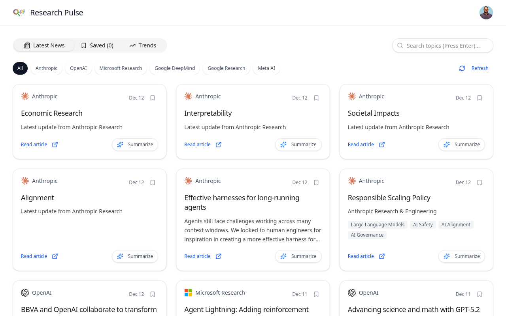
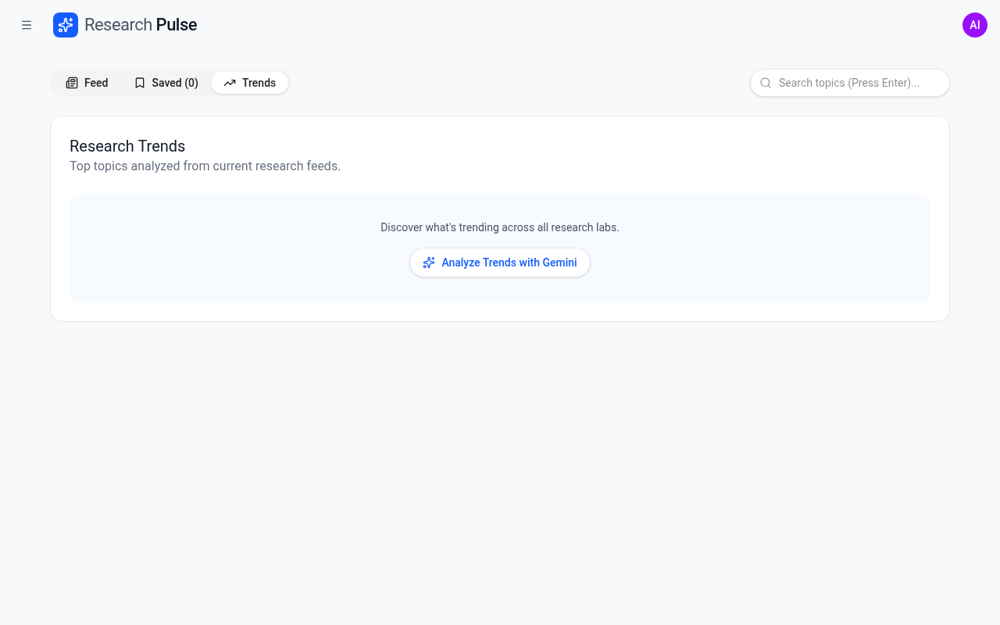

# Research Pulse
 
> "It's a struggle to keep pace with the developments in generative AI and the brisk pace of innovation and competition. But AI can help you keep abreast of AI."
 
Stay ahead of the curve with **Research Pulse**, a real-time dashboard that aggregates, analyzes, and visualizes the latest AI research from top labs including **Google DeepMind**, **Google Research**, **OpenAI**, **Anthropic**, **Meta AI**, and **Microsoft Research**.
 
Powered by **Gemini 2.5 Flash** and **Vertex AI**, this application uses advanced semantic search, auto-tagging, and topic modeling to help you find relevant research instantly.
 
## ✨ Features
 
- **Smart Caching & Refresh**:
  - **Instant Load**: The application serves cached articles from a local SQLite database immediately for sub-second load times.
  - **Background Refresh**: A non-blocking background process fetches the latest RSS feeds and scrapes new content, updating the database without slowing down the user experience.
- **Real-time Aggregation**: Fetches latest research from RSS feeds (Google, DeepMind, Microsoft, Meta) and direct scraping (Anthropic).
- **Semantic & Hybrid Search**: Search for concepts like "LLM scaling" or "RLHF" using vector embeddings (`text-embedding-004`) combined with keyword boosting.
- **AI-Powered Insights**:
  - **Weekly Audio Overviews**: Listen to a curated weekly summary or a deep-dive podcast featuring two AI hosts (Dr. Anya & Liam) with **British English pronunciation**.
  - **Custom Insights**: Generate personalized audio summaries for specific articles on demand using Gemini 2.5 TTS.
  - **Auto-Tagging**: Articles are automatically tagged with technical keywords (e.g., "Computer Vision", "Transformers") using Gemini 2.5 Flash.
  - **Smart Summaries**: Get concise 3-bullet summaries of any article on demand.
  - **Trend Analysis**: Visualize trending topics across all research labs with a comprehensive markdown report generated by Gemini.
- **Enhanced UI/UX**:
  - **"I'm Feeling Lucky"**: Instantly discover a random, high-quality article from the last 3 months.
  - **Explore Full Feed**: One-click access to the complete chronological feed of all research.
  - **Modern Design**: Clean, Google-style interface with responsive layout and dark mode support.
  - **Audio Player**: Integrated audio player with playback controls and transcript viewer.

## � Screenshots


*Real-time News Feed with AI Tags and Summaries*


*AI-Powered Trend Analysis using Gemini 3.0 Pro*

## �🚀 Deployment

The application is containerized and deployed on **Google Cloud Run**.

### Deploying to Cloud Run

1. **Build and Deploy**:
   ```bash
   gcloud run deploy your-service-name \
     --source . \
     --region your-gcp-region \
     --allow-unauthenticated \
     --set-env-vars GOOGLE_CLOUD_PROJECT=your-gcp-project-id,GOOGLE_CLOUD_LOCATION=your-gcp-region
   ```

2. **Database Configuration**:
   Ensure your Cloud Run service is connected to the Cloud SQL instance:
   ```bash
   gcloud run deploy your-service-name \
     --source . \
     --region your-gcp-region \
     --allow-unauthenticated \
     --add-cloudsql-instances your-gcp-project-id:your-gcp-region:your-cloud-sql-instance \
     --set-env-vars GOOGLE_CLOUD_PROJECT=your-gcp-project-id,GOOGLE_CLOUD_LOCATION=your-gcp-region,POSTGRES_USER=postgres,POSTGRES_PASSWORD=your-db-password,POSTGRES_DB=postgres,POSTGRES_HOST=/cloudsql/your-gcp-project-id:your-gcp-region:your-cloud-sql-instance
   ```

## 🛠️ Tech Stack

- **Frontend**: Next.js 15 (App Router), Tailwind CSS, Lucide Icons.
- **Backend**: Next.js API Routes, Puppeteer (for complex scraping).
- **Database**: Cloud SQL for PostgreSQL (`pg`, `pgvector`) for storing articles, embeddings, and tags. (Migrated from SQLite/`better-sqlite3`).
- **Storage**: **Google Cloud Storage** (`@google-cloud/storage`) for persisting generated audio insights and podcasts.
- **AI Models (Vertex AI)**:
  - `gemini-2.5-flash`: For fast article summarization and auto-tagging.
  - `gemini-2.5-pro`: For deep trend analysis and podcast script generation.
  - `gemini-2.5-flash-preview-tts`: For generating high-quality audio insights with a **British English accent**.
  - `text-embedding-004`: For semantic search embeddings.

## 💻 Local Development

1. **Clone the repository:**
   ```bash
   git clone https://github.com/salekh/ai-research-pulse.git
   cd ai-research-pulse
   ```

2. **Install dependencies:**
   ```bash
   npm install
   ```

3. **Authenticate with Google Cloud (ADC):**
   ```bash
   gcloud auth application-default login
   ```

4. **Start Cloud SQL Proxy:**
   Download and run the Cloud SQL Proxy to connect to the database locally:
   ```bash
   ./cloud-sql-proxy your-gcp-project-id:your-gcp-region:your-cloud-sql-instance
   ```

5. **Run the development server:**
   ```bash
   npm run dev
   ```
   Open [http://localhost:3000](http://localhost:3000).

6. **Backfill Data (Optional):**
   To populate the database with the latest articles:
   ```bash
   npx tsx scripts/fetch-rss.ts
   ```

## 🔍 Architecture Highlights

- **Hybrid Search**: Combines cosine similarity of embeddings with keyword matching. Search now operates across **all time ranges** by default when a query is present, prioritizing semantic relevance over recency.
- **Robust Scraping**: Uses `rss-parser` for reliable feed ingestion from major labs (OpenAI, DeepMind, Google Research, Anthropic, x.AI).
- **Data Enrichment**: Every ingested article is processed to generate a vector embedding and relevant tags, enabling rich filtering and discovery.
- **Vertex AI Reranker**: Search results are re-ranked using the **Vertex AI Discovery Engine API** (`semantic-ranker-512@latest`). This ensures that the top results are semantically relevant to the user's query. A similarity score (e.g., "85% match") is displayed on each card.
- **Trend Analysis**: Uses **Gemini 2.5 Pro** to analyze the titles of all recent articles. It generates a structured JSON response containing:
  - A quantitative distribution of topics (for the pie chart).
  - A comprehensive markdown report with sections like "Executive Summary", "Key Emerging Themes", and "Future Outlook".

## License

Apache 2.0
