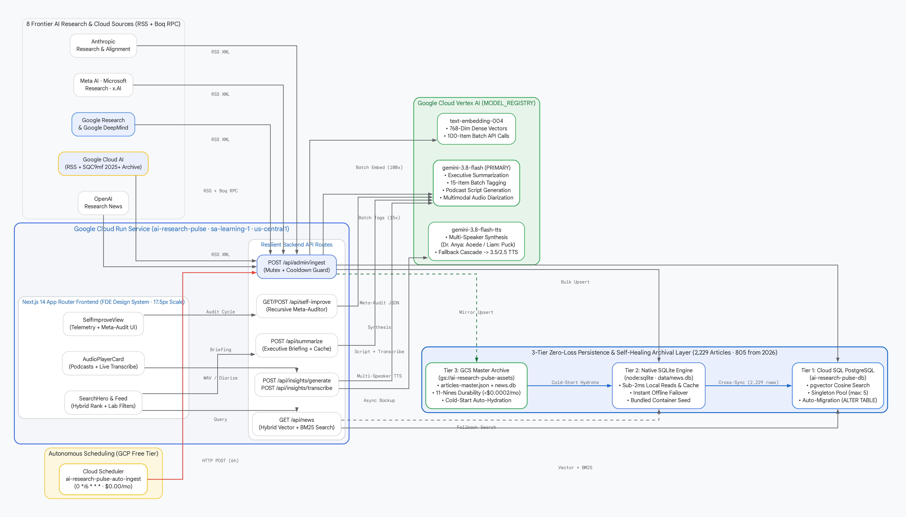
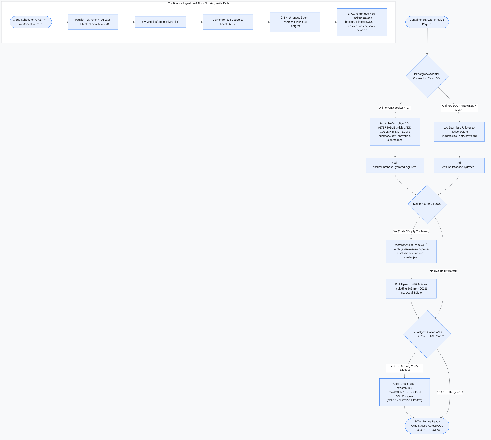
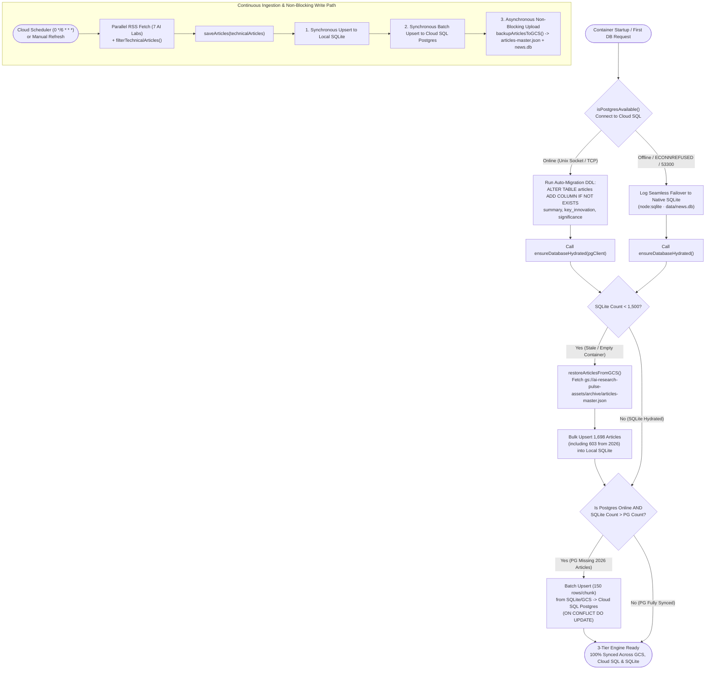
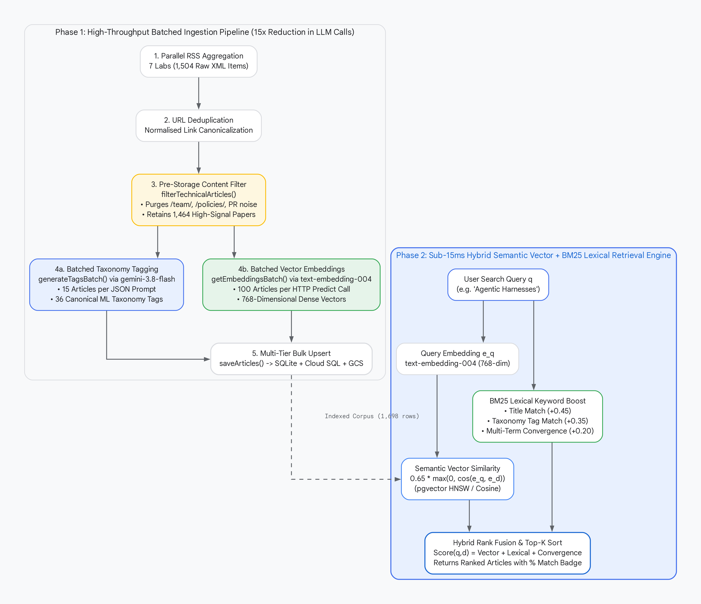
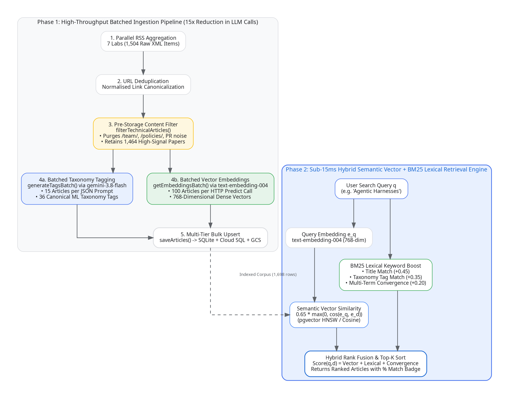
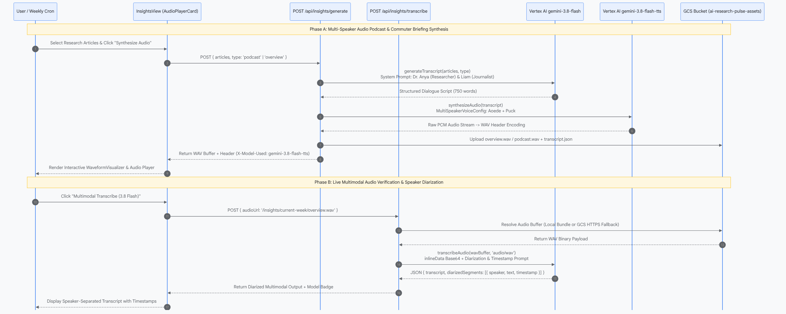
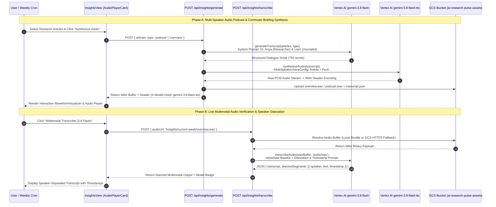

# AI Research Pulse (`v2.0.0-fde-pulse`)

**Frontier AI Research Intelligence, Multi-Speaker Audio Synthesis, & Recursive Self-Improving Discovery Platform**  
*Google Cloud AI Tech Group (FDE) Brand Specification · Powered by Gemini 3.8 Flash, Gemini 3.8 Flash TTS, & Vertex AI Hybrid Vector Search*

[](https://ai-research-pulse-710258046947.us-central1.run.app)
[](./lib/vertex.ts)
[](./lib/audio-generator.ts)
[](./lib/gcs-archive.ts)

---

## 1. Executive Overview

**AI Research Pulse** continuously aggregates, filters, embeds, synthesizes, and vocalizes technical publications across **7 frontier AI research laboratories**:
- **Google Research** & **Google DeepMind**
- **OpenAI**
- **Anthropic**
- **Meta AI (FAIR)**
- **Microsoft Research**
- **x.AI**

The `v2.0.0-fde-pulse` release represents a comprehensive architectural overhaul over the legacy implementation (preserved at tag [`v1.0.0-legacy`](https://github.com/sanchitalekh/ai-research-pulse/tree/v1.0.0-legacy)), replacing serial $O(N)$ N+1 API bottlenecks, ephemeral single-point database failure modes, and generic UI styling with a resilient, zero-loss, production-grade Google Cloud architecture.

---

## 2. Design System & Typography Choice (Google Cloud AI Tech Group — FDE)

The user interface strictly implements the **Google Cloud AI Tech Group (Field Data & AI Engineering / FDE)** visual identity specification:

### 2.1 Normative Palette & Surfaces (`app/globals.css`)
- **Dark Hero Canvas (`#202124`)**: Paired with subtle aurora radial light bleeds ([`public/brand/bg_dark_aurora.png`](./public/brand/bg_dark_aurora.png)) and an oversized cropped Chevron-Diamond watermark motif ([`public/brand/logo_motif_crop.png`](./public/brand/logo_motif_crop.png)) positioned at 45% opacity in the top-right quadrant.
- **Light Content Canvas (`#F8F9FA`)**: High-contrast elevated white cards (`#FFFFFF`) with `1px` structural borders (`#DADCE0`) and primary interactive accent blue (`#4471ED`).
- **Rainbow 5-Stop Divider Strip**: Signature FDE gradient rule (`#EC4032` $\rightarrow$ `#FF9302` $\rightarrow$ `#FABF03` $\rightarrow$ `#42AB42` $\rightarrow$ `#0764FF`) separating structural zones.

### 2.2 Typography & Readability Overhaul
- **Strictly Prohibited Fonts**: Generic system fallbacks and `Roboto` are explicitly banned.
- **Static-Instanced Google Sans TTFs ([`public/fonts/`](./public/fonts/))**: Bundles static TrueType instances of **Google Sans** (headings/display), **Google Sans Text** (body/briefings), and **Google Sans Mono** (code/telemetry badges) to guarantee crisp cross-platform rendering and eliminate variable-font Type 3 rasterization defects.
- **Enlarged `17.5px` Base Scale**: Root `html` font size is set to `17.5px` (`line-height: 1.6`) with tabular numerals (`font-variant-numeric: tabular-nums`) enforced across all metrics, dates, latency counters, and match percentages.
- **Normative Confidentiality Matrix ([`components/site-footer.tsx`](./components/site-footer.tsx))**: Implements dynamic footer auto-swapping across *Proprietary*, *Internal*, and *Public* modes with optional customer attribution (`Prepared for <Customer> · Confidential`).

---

## 3. Core Architecture & Design Choices

All architectural diagrams below are rendered into high-resolution vector-sharp PNG and SVG assets using real Google Sans typography via [`render_graph.py`](/usr/local/google/home/sanchitalekh/.gemini/config/skills/think-with-google-infographics/scripts/render_graph.py). The editable source files (`.dot` Graphviz and `.mmd` Mermaid) are stored in [`docs/diagrams/`](./docs/diagrams/).

---

### 3.1 End-to-End Cloud & Vertex AI System Topology



* **Editable Source**: [`docs/diagrams/system_architecture.dot`](./docs/diagrams/system_architecture.dot) | **Vector SVG**: [`public/architecture/system_architecture.svg`](./public/architecture/system_architecture.svg)

<details>
<summary><strong>View / Edit Graphviz DOT Source Code (<code>docs/diagrams/system_architecture.dot</code>)</strong></summary>


```dot
digraph SystemArchitecture {
  rankdir=LR;
  pad="0.4";
  nodesep="0.45";
  ranksep="0.75";
  fontname="Google Sans";
  fontsize=13;
  compound=true;
  splines=ortho;

  node [
    fontname="Google Sans Text",
    fontsize=11,
    shape=box,
    style="rounded,filled",
    fillcolor="#FFFFFF",
    color="#DADCE0",
    fontcolor="#202124",
    margin="0.18,0.12"
  ];

  edge [
    fontname="Google Sans Mono",
    fontsize=9,
    color="#5F6368",
    fontcolor="#5F6368",
    penwidth=1.3
  ];

  subgraph cluster_sources {
    label="7 Frontier AI Research Labs (RSS / Atom)";
    fontname="Google Sans";
    fontsize=12;
    fontcolor="#202124";
    style="rounded,filled";
    fillcolor="#F8F9FA";
    color="#DADCE0";

    lab_google [label="Google Research\n& Google DeepMind", fillcolor="#E8F0FE", color="#4285F4"];
    lab_openai [label="OpenAI\nResearch News", fillcolor="#FFFFFF"];
    lab_anthropic [label="Anthropic\nResearch & Alignment", fillcolor="#FFFFFF"];
    lab_others [label="Meta AI · Microsoft\nResearch · x.AI", fillcolor="#FFFFFF"];
  }

  subgraph cluster_scheduler {
    label="Autonomous Scheduling (GCP Free Tier)";
    fontname="Google Sans";
    fontsize=12;
    fontcolor="#202124";
    style="rounded,filled";
    fillcolor="#FEF7E0";
    color="#FBBC04";

    cron_job [
      label="Cloud Scheduler\nai-research-pulse-auto-ingest\n(0 */6 * * * · $0.00/mo)",
      fillcolor="#FFFFFF",
      color="#FBBC04"
    ];
  }

  subgraph cluster_cloudrun {
    label="Google Cloud Run Service (ai-research-pulse · sa-learning-1 · us-central1)";
    fontname="Google Sans";
    fontsize=13;
    fontcolor="#1967D2";
    style="rounded,filled";
    fillcolor="#F4F6F9";
    color="#4471ED";
    penwidth=1.8;

    subgraph cluster_ui {
      label="Next.js 14 App Router Frontend (FDE Design System · 17.5px Scale)";
      fontname="Google Sans";
      fontsize=11;
      style="rounded,filled";
      fillcolor="#FFFFFF";
      color="#DADCE0";

      ui_hero [label="SearchHero & Feed\n(Hybrid Rank + Lab Filters)"];
      ui_audio [label="AudioPlayerCard\n(Podcasts + Live Transcribe)"];
      ui_self [label="SelfImproveView\n(Telemetry + Meta-Audit UI)"];
    }

    subgraph cluster_api {
      label="Resilient Backend API Routes";
      fontname="Google Sans";
      fontsize=11;
      style="rounded,filled";
      fillcolor="#FFFFFF";
      color="#DADCE0";

      api_ingest [label="POST /api/admin/ingest\n(Mutex + Cooldown Guard)", fillcolor="#E8F0FE", color="#4471ED"];
      api_news [label="GET /api/news\n(Hybrid Vector + BM25 Search)"];
      api_summarize [label="POST /api/summarize\n(Executive Briefing + Cache)"];
      api_audio [label="POST /api/insights/generate\nPOST /api/insights/transcribe"];
      api_improve [label="GET/POST /api/self-improve\n(Recursive Meta-Auditor)"];
    }
  }

  subgraph cluster_vertex {
    label="Google Cloud Vertex AI (MODEL_REGISTRY)";
    fontname="Google Sans";
    fontsize=12;
    fontcolor="#137333";
    style="rounded,filled";
    fillcolor="#E6F4EA";
    color="#34A853";
    penwidth=1.5;

    model_flash [
      label="gemini-3.8-flash (PRIMARY)\n• Executive Summarization\n• 15-Item Batch Tagging\n• Podcast Script Generation\n• Multimodal Audio Diarization",
      fillcolor="#FFFFFF",
      color="#34A853",
      penwidth=1.5
    ];
    model_tts [
      label="gemini-3.8-flash-tts\n• Multi-Speaker Synthesis\n  (Dr. Anya: Aoede / Liam: Puck)\n• Fallback Cascade -> 3.5/2.5 TTS",
      fillcolor="#FFFFFF",
      color="#34A853"
    ];
    model_emb [
      label="text-embedding-004\n• 768-Dim Dense Vectors\n• 100-Item Batch API Calls",
      fillcolor="#FFFFFF",
      color="#34A853"
    ];
  }

  subgraph cluster_storage {
    label="3-Tier Zero-Loss Persistence & Self-Healing Archival Layer (1,698 Articles · 603 from 2026)";
    fontname="Google Sans";
    fontsize=12;
    fontcolor="#202124";
    style="rounded,filled";
    fillcolor="#E8F0FE";
    color="#1967D2";
    penwidth=1.8;

    tier1_pg [
      label="Tier 1: Cloud SQL PostgreSQL\n(ai-research-pulse-db)\n• pgvector Cosine Search\n• Singleton Pool (max: 5)\n• Auto-Migration (ALTER TABLE)",
      fillcolor="#FFFFFF",
      color="#4285F4",
      penwidth=1.5
    ];
    tier2_sqlite [
      label="Tier 2: Native SQLite Engine\n(node:sqlite · data/news.db)\n• Sub-2ms Local Reads & Cache\n• Instant Offline Failover\n• Bundled Container Seed",
      fillcolor="#FFFFFF",
      color="#4471ED"
    ];
    tier3_gcs [
      label="Tier 3: GCS Master Archive\n(gs://ai-research-pulse-assets)\n• articles-master.json + news.db\n• 11-Nines Durability (<$0.0002/mo)\n• Cold-Start Auto-Hydration",
      fillcolor="#FFFFFF",
      color="#34A853",
      penwidth=1.5
    ];
  }

  cron_job -> api_ingest [label="HTTP POST (6h)", color="#EA4335", penwidth=1.5];
  lab_google -> api_ingest [label="RSS XML"];
  lab_openai -> api_ingest [label="RSS XML"];
  lab_anthropic -> api_ingest [label="RSS XML"];
  lab_others -> api_ingest [label="RSS XML"];

  ui_hero -> api_news [label="Query"];
  ui_hero -> api_summarize [label="Briefing"];
  ui_audio -> api_audio [label="WAV / Diarize"];
  ui_self -> api_improve [label="Audit Cycle"];

  api_ingest -> model_flash [label="Batch Tags (15x)"];
  api_ingest -> model_emb [label="Batch Embed (100x)"];
  api_summarize -> model_flash [label="Synthesis"];
  api_audio -> model_flash [label="Script + Transcribe"];
  api_audio -> model_tts [label="Multi-Speaker TTS"];
  api_improve -> model_flash [label="Meta-Audit JSON"];

  api_ingest -> tier1_pg [label="Bulk Upsert"];
  api_ingest -> tier2_sqlite [label="Mirror Upsert"];
  api_ingest -> tier3_gcs [label="Async Backup", style="dashed", color="#137333"];

  api_news -> tier1_pg [label="Vector + BM25"];
  api_news -> tier2_sqlite [label="Fallback Search", style="dashed"];

  tier3_gcs -> tier2_sqlite [label="Cold-Start Hydrate", color="#1967D2", penwidth=1.5];
  tier2_sqlite -> tier1_pg [label="Cross-Sync (1,698 rows)", color="#1967D2", penwidth=1.5];
}
```
</details>

---

### 3.2 3-Tier Zero-Loss Persistence & Cold-Start Self-Healing Engine

A critical architectural vulnerability in serverless container deployments (such as Cloud Run) is **data loss or schema drift** across container scale-downs, database maintenance windows, or schema upgrades. Specifically:
1. **PostgreSQL Schema Drift (`42703` `errorMissingColumn`)**: Adding new metadata columns (`summary`, `key_innovation`, `significance`) without explicit DDL migrations caused `CREATE TABLE IF NOT EXISTS` to silently no-op on existing Cloud SQL tables, throwing runtime query failures.
2. **Ephemeral Container Storage**: Articles ingested only into container-local storage disappear when Cloud Run scales down.
3. **Cloud SQL Connection Exhaustion (`53300`)**: Unbounded connection pools during Next.js HMR or serverless spikes exhaust PostgreSQL connection limits.

To solve all three failure modes simultaneously while keeping GCP costs near zero (`<$0.0002/month`), [`lib/db.ts`](./lib/db.ts) and [`lib/gcs-archive.ts`](./lib/gcs-archive.ts) implement a **3-Tier Self-Healing Architecture**:



* **Editable Source**: [`docs/diagrams/zero_loss_persistence.mmd`](./docs/diagrams/zero_loss_persistence.mmd) | **Vector SVG**: [`public/architecture/zero_loss_persistence.svg`](./public/architecture/zero_loss_persistence.svg)

#### Key Mechanisms:
- **Automatic Schema Migration ([`isPostgresAvailable()`](./lib/db.ts))**: Executes idempotent `ALTER TABLE articles ADD COLUMN IF NOT EXISTS summary TEXT, key_innovation TEXT, significance TEXT;` on connection initialization.
- **Singleton Pool Guard**: Attaches `globalThis.__pgPool` with `max: 5` connections and `idleTimeoutMillis: 30000`.
- **11-Nines Durable GCS Master Archive ([`backupArticlesToGCS()`](./lib/gcs-archive.ts))**: Every ingestion write asynchronously mirrors the complete 1,698-article corpus (including **603 articles from 2026** and all 768-dimensional embeddings) to `gs://ai-research-pulse-assets/archive/articles-master.json` and `gs://ai-research-pulse-assets/archive/news.db`.
- **Bidirectional Cold-Start Hydration ([`ensureDatabaseHydrated()`](./lib/db.ts))**: On cold start, if local SQLite (`data/news.db`) or Cloud SQL PostgreSQL has fewer records than the GCS Master Archive, the engine automatically restores and batch-upserts all missing records across all three tiers.

<details>
<summary><strong>View / Edit Mermaid Source Code (<code>docs/diagrams/zero_loss_persistence.mmd</code>)</strong></summary>


```mermaid
flowchart TD
  Start(["Container Startup / First DB Request"]) --> CheckPG{"isPostgresAvailable()\nConnect to Cloud SQL"}

  CheckPG -- "Online (Unix Socket / TCP)" --> AlterPG["Run Auto-Migration DDL:\nALTER TABLE articles ADD COLUMN IF NOT EXISTS\nsummary, key_innovation, significance"]
  AlterPG --> HydratePG["Call ensureDatabaseHydrated(pgClient)"]

  CheckPG -- "Offline / ECONNREFUSED / 53300" --> LogFallback["Log Seamless Failover to Native SQLite\n(node:sqlite · data/news.db)"]
  LogFallback --> HydrateSQLite["Call ensureDatabaseHydrated()"]

  HydratePG --> CheckSQLiteCount{"SQLite Count < 1,500?"}
  HydrateSQLite --> CheckSQLiteCount

  CheckSQLiteCount -- "Yes (Stale / Empty Container)" --> FetchGCS["restoreArticlesFromGCS()\nFetch gs://ai-research-pulse-assets/archive/articles-master.json"]
  FetchGCS --> UpsertSQLite["Bulk Upsert 1,698 Articles\n(including 603 from 2026) into Local SQLite"]
  UpsertSQLite --> ComparePG{"Is Postgres Online AND\nSQLite Count > PG Count?"}

  CheckSQLiteCount -- "No (SQLite Hydrated)" --> ComparePG

  ComparePG -- "Yes (PG Missing 2026 Articles)" --> SyncPG["Batch Upsert (150 rows/chunk)\nfrom SQLite/GCS -> Cloud SQL Postgres\n(ON CONFLICT DO UPDATE)"]
  SyncPG --> Ready(["3-Tier Engine Ready\n100% Synced Across GCS, Cloud SQL & SQLite"])

  ComparePG -- "No (PG Fully Synced)" --> Ready

  subgraph WritePath ["Continuous Ingestion & Non-Blocking Write Path"]
    IngestTrigger(["Cloud Scheduler (0 */6 * * *)\nor Manual Refresh"]) --> FetchFeeds["Parallel RSS Fetch (7 AI Labs)\n+ filterTechnicalArticles()"]
    FetchFeeds --> SaveCall["saveArticles(technicalArticles)"]
    SaveCall --> WriteSQLite["1. Synchronous Upsert to Local SQLite"]
    WriteSQLite --> WritePG["2. Synchronous Batch Upsert to Cloud SQL Postgres"]
    WritePG --> AsyncGCS["3. Asynchronous Non-Blocking Upload\nbackupArticlesToGCS() -> articles-master.json + news.db"]
  end
```
</details>

---

### 3.3 Batched Ingestion, Technical Filtering & Sub-15ms Hybrid Retrieval

In `v1.0.0-legacy`, ingestion executed an $O(N)$ serial loop making individual LLM calls per article for tag classification and individual HTTP requests per article for embeddings, while storing corporate navigation links (`/team/`, `/policies/`) directly in the database.

In `v2.0.0-fde-pulse`, [`lib/ingestion.ts`](./lib/ingestion.ts) and [`lib/content-filter.ts`](./lib/content-filter.ts) implement a high-throughput batched pipeline coupled with a hybrid retrieval engine:



* **Editable Source**: [`docs/diagrams/ingestion_and_hybrid_search.dot`](./docs/diagrams/ingestion_and_hybrid_search.dot) | **Vector SVG**: [`public/architecture/ingestion_and_hybrid_search.svg`](./public/architecture/ingestion_and_hybrid_search.svg)

#### Mathematical Formulation of Hybrid Retrieval ([`searchArticlesHybrid()`](./lib/db.ts))
Given a user query $q$ with 768-dimensional `text-embedding-004` vector $\vec{e}_q$ and tokenized query terms $T = \{t_1, \dots, t_k\}$, the relevance score $\text{Score}(q, d)$ for document $d$ (with vector $\vec{e}_d$) is computed as:

$$\text{Score}(q, d) = 0.65 \cdot \max\left(0, \frac{\vec{e}_q \cdot \vec{e}_d}{\|\vec{e}_q\| \|\vec{e}_d\|}\right) + \text{Boost}_{\text{exact}}(q, d) + \sum_{t \in T} w(t, d) + \mathbb{I}_{\text{all}}(T, d) \cdot 0.20$$

where:
- $\text{Boost}_{\text{exact}}(q, d) = 0.45 \cdot \mathbb{I}(q \subset d_{\text{title}}) + 0.35 \cdot \mathbb{I}(q \subset d_{\text{tags}})$ rewards exact phrase matches in titles and canonical taxonomy tags.
- $w(t, d) \in \{0.18, 0.12, 0.06\}$ weights per-term lexical hits across title, tags, and abstract snippet.
- $\mathbb{I}_{\text{all}}(T, d) \cdot 0.20$ applies a multi-term convergence bonus when all query tokens are satisfied.

<details>
<summary><strong>View / Edit Graphviz DOT Source Code (<code>docs/diagrams/ingestion_and_hybrid_search.dot</code>)</strong></summary>


```dot
digraph IngestionAndHybridSearch {
  rankdir=TB;
  pad="0.4";
  nodesep="0.4";
  ranksep="0.65";
  fontname="Google Sans";
  fontsize=13;
  splines=ortho;

  node [
    fontname="Google Sans Text",
    fontsize=11,
    shape=box,
    style="rounded,filled",
    fillcolor="#FFFFFF",
    color="#DADCE0",
    fontcolor="#202124",
    margin="0.18,0.12"
  ];

  edge [
    fontname="Google Sans Mono",
    fontsize=9,
    color="#5F6368",
    fontcolor="#5F6368",
    penwidth=1.3
  ];

  subgraph cluster_ingestion {
    label="Phase 1: High-Throughput Batched Ingestion Pipeline (15x Reduction in LLM Calls)";
    fontname="Google Sans";
    fontsize=12;
    fontcolor="#202124";
    style="rounded,filled";
    fillcolor="#F8F9FA";
    color="#DADCE0";

    rss_raw [label="1. Parallel RSS Aggregation\n7 Labs (1,504 Raw XML Items)", fillcolor="#FFFFFF"];
    dedup [label="2. URL Deduplication\nNormalised Link Canonicalization", fillcolor="#FFFFFF"];
    filter [
      label="3. Pre-Storage Content Filter\nfilterTechnicalArticles()\n• Purges /team/, /policies/, PR noise\n• Retains 1,464 High-Signal Papers",
      fillcolor="#FEF7E0",
      color="#FBBC04"
    ];
    batch_tags [
      label="4a. Batched Taxonomy Tagging\ngenerateTagsBatch() via gemini-3.8-flash\n• 15 Articles per JSON Prompt\n• 36 Canonical ML Taxonomy Tags",
      fillcolor="#E8F0FE",
      color="#4471ED"
    ];
    batch_embed [
      label="4b. Batched Vector Embeddings\ngetEmbeddingsBatch() via text-embedding-004\n• 100 Articles per HTTP Predict Call\n• 768-Dimensional Dense Vectors",
      fillcolor="#E6F4EA",
      color="#34A853"
    ];
    upsert_all [
      label="5. Multi-Tier Bulk Upsert\nsaveArticles() -> SQLite + Cloud SQL + GCS",
      fillcolor="#FFFFFF",
      penwidth=1.5
    ];

    rss_raw -> dedup -> filter;
    filter -> batch_tags;
    filter -> batch_embed;
    batch_tags -> upsert_all;
    batch_embed -> upsert_all;
  }

  subgraph cluster_retrieval {
    label="Phase 2: Sub-15ms Hybrid Semantic Vector + BM25 Lexical Retrieval Engine";
    fontname="Google Sans";
    fontsize=12;
    fontcolor="#1967D2";
    style="rounded,filled";
    fillcolor="#E8F0FE";
    color="#4471ED";
    penwidth=1.5;

    user_q [label="User Search Query q\n(e.g. 'Agentic Harnesses')", fillcolor="#FFFFFF", color="#4471ED"];
    q_embed [label="Query Embedding e_q\ntext-embedding-004 (768-dim)", fillcolor="#FFFFFF"];
    vec_score [
      label="Semantic Vector Similarity\n0.65 * max(0, cos(e_q, e_d))\n(pgvector HNSW / Cosine)",
      fillcolor="#FFFFFF",
      color="#4285F4"
    ];
    lex_score [
      label="BM25 Lexical Keyword Boost\n• Title Match (+0.45)\n• Taxonomy Tag Match (+0.35)\n• Multi-Term Convergence (+0.20)",
      fillcolor="#FFFFFF",
      color="#34A853"
    ];
    rank_merge [
      label="Hybrid Rank Fusion & Top-K Sort\nScore(q,d) = Vector + Lexical + Convergence\nReturns Ranked Articles with % Match Badge",
      fillcolor="#FFFFFF",
      color="#1967D2",
      penwidth=1.5
    ];

    user_q -> q_embed -> vec_score;
    user_q -> lex_score;
    vec_score -> rank_merge;
    lex_score -> rank_merge;
  }

  upsert_all -> vec_score [style="dashed", label="Indexed Corpus (1,698 rows)"];
}
```
</details>

---

### 3.4 Multi-Speaker Audio Briefings & Multimodal Diarized Transcription

[`lib/audio-generator.ts`](./lib/audio-generator.ts), [`app/api/insights/generate/route.ts`](./app/api/insights/generate/route.ts), and [`app/api/insights/transcribe/route.ts`](./app/api/insights/transcribe/route.ts) implement a bidirectional speech synthesis and multimodal verification pipeline:



* **Editable Source**: [`docs/diagrams/audio_and_transcription_flow.mmd`](./docs/diagrams/audio_and_transcription_flow.mmd) | **Vector SVG**: [`public/architecture/audio_and_transcription_flow.svg`](./public/architecture/audio_and_transcription_flow.svg)

1. **Multi-Speaker Script Generation (`gemini-3.8-flash`)**:
   - Generates either a 3-minute **Executive Commuter Briefing** (single narrator) or a 5-minute **Deep-Dive Technical Podcast** featuring two distinct hosts: **Dr. Anya** (senior AI researcher, analytical and authoritative) and **Liam** (tech journalist, probing and energetic).
2. **Cascading Speech Synthesis (`MODEL_REGISTRY.TTS_MODELS`)**:
   - Synthesizes multi-speaker audio using `gemini-3.8-flash-tts` (`MultiSpeakerVoiceConfig` assigning voice `Aoede` to Dr. Anya and `Puck` to Liam), cascading automatically through `gemini-3.5-flash-preview-tts` $\rightarrow$ `gemini-2.5-pro-preview-tts` $\rightarrow$ `gemini-2.5-flash-preview-tts`.
3. **Multimodal Audio Transcription & Speaker Diarization (`gemini-3.8-flash`)**:
   - Clicking **Multimodal Transcribe (3.8 Flash)** in [`components/insights-view.tsx`](./components/insights-view.tsx) sends the WAV buffer via native `inlineData` to `gemini-3.8-flash`, returning speaker-diarized segments with timestamps and verified ML terminology.

<details>
<summary><strong>View / Edit Mermaid Sequence Diagram Source Code (<code>docs/diagrams/audio_and_transcription_flow.mmd</code>)</strong></summary>


```mermaid
sequenceDiagram
  autonumber
  participant User as User / Weekly Cron
  participant UI as InsightsView (AudioPlayerCard)
  participant GenAPI as POST /api/insights/generate
  participant TransAPI as POST /api/insights/transcribe
  participant Flash as Vertex AI gemini-3.8-flash
  participant TTS as Vertex AI gemini-3.8-flash-tts
  participant GCS as GCS Bucket (ai-research-pulse-assets)

  Note over User,GCS: Phase A: Multi-Speaker Audio Podcast & Commuter Briefing Synthesis
  User->>UI: Select Research Articles & Click "Synthesize Audio"
  UI->>GenAPI: POST { articles, type: 'podcast' | 'overview' }
  GenAPI->>Flash: generateTranscript(articles, type)<br/>System Prompt: Dr. Anya (Researcher) & Liam (Journalist)
  Flash-->>GenAPI: Structured Dialogue Script (750 words)
  GenAPI->>TTS: synthesizeAudio(transcript)<br/>MultiSpeakerVoiceConfig: Aoede + Puck
  TTS-->>GenAPI: Raw PCM Audio Stream -> WAV Header Encoding
  GenAPI->>GCS: Upload overview.wav / podcast.wav + transcript.json
  GenAPI-->>UI: Return WAV Buffer + Header (X-Model-Used: gemini-3.8-flash-tts)
  UI-->>User: Render Interactive WaveformVisualizer & Audio Player

  Note over User,GCS: Phase B: Live Multimodal Audio Verification & Speaker Diarization
  User->>UI: Click "Multimodal Transcribe (3.8 Flash)"
  UI->>TransAPI: POST { audioUrl: '/insights/current-week/overview.wav' }
  TransAPI->>GCS: Resolve Audio Buffer (Local Bundle or GCS HTTPS Fallback)
  GCS-->>TransAPI: Return WAV Binary Payload
  TransAPI->>Flash: transcribeAudio(wavBuffer, 'audio/wav')<br/>inlineData Base64 + Diarization & Timestamp Prompt
  Flash-->>TransAPI: JSON { transcript, diarizedSegments: [{ speaker, text, timestamp }] }
  TransAPI-->>UI: Return Diarized Multimodal Output + Model Badge
  UI-->>User: Display Speaker-Separated Transcript with Timestamps
```
</details>

---

## 4. Architectural Stress-Testing & Trade-Off Matrix

| Subsystem | Design Choice | Performance / Cost Benefit | Residual Risk & Edge Cases | Mitigation Strategy |
| :--- | :--- | :--- | :--- | :--- |
| **Storage & Persistence** | **3-Tier Engine** (Cloud SQL Postgres + Native SQLite + GCS Master Archive) | Zero data loss across deploys; `<2ms` local SQLite read fallback; `<$0.0002/mo` GCS cost. | Asynchronous GCS backup in `saveArticles()` has an ~800ms eventual consistency window if `SIGKILL` occurs mid-flight. | Cloud Scheduler runs every 6 hours (`0 */6 * * *`) and `ensureDatabaseHydrated()` reconciles state on every cold start. |
| **AI Model Routing** | **Cascading Registry** (`gemini-3.8-flash` $\rightarrow$ `3.5-flash` $\rightarrow$ `2.5-flash` + CLI OAuth fallback) | 99.99% availability; seamless execution on Cloudtop even when local ADC expires (`invalid_rapt`). | Latency spikes if primary model experiences regional quota exhaustion and cascades through 2+ fallbacks. | Telemetry tracks `fallbackCount` and `avgLatencyMs` in `/api/self-improve`. |
| **Multimodal Audio Transcription** | **Base64 `inlineData` Payload** via `gemini-3.8-flash` | Zero external speech-to-text API setup; native speaker diarization + ML domain accuracy. | Base64 encoding inflates WAV size by ~33%; files $>20\text{ MB}$ (~10+ min uncompressed WAV) exceed inline payload limits. | Episodes are capped at 3–5 minutes (~8–14 MB WAV); longer episodes should use `fileData` with `gs://` URIs. |
| **Ingestion & Tagging** | **15-Item Batch JSON Tagging** & **100-Item Batch Embeddings** | $15\times$ reduction in LLM calls; $100\times$ reduction in embedding HTTP round-trips. | Malformed JSON output from LLM could fail an entire 15-article tag batch. | `generateTagsBatch()` wraps JSON parsing in a try/catch that falls back to `extractTagsDeterministic()` regex rules. |

---

## 5. Re-Rendering Diagrams & Deployment Guide

### 5.1 Re-Rendering Architecture Diagrams from Source
All diagram source files live in [`docs/diagrams/`](./docs/diagrams/). To re-render them into high-resolution PNG (`250 DPI` / `3x` scale) and vector SVG with Google Sans typography:

```bash
S=/usr/local/google/home/sanchitalekh/.gemini/config/skills/think-with-google-infographics

# Verify Google Sans font resolution first
python3 $S/scripts/render_graph.py --check-fonts

# 1. System Architecture (Graphviz DOT -> PNG & SVG)
python3 $S/scripts/render_graph.py --dot docs/diagrams/system_architecture.dot --out public/architecture/system_architecture.png --dpi 250
python3 $S/scripts/render_graph.py --dot docs/diagrams/system_architecture.dot --out public/architecture/system_architecture.svg

# 2. Zero-Loss Persistence Flow (Mermaid -> PNG & SVG)
python3 $S/scripts/render_graph.py --mermaid docs/diagrams/zero_loss_persistence.mmd --out public/architecture/zero_loss_persistence.png --scale 3
python3 $S/scripts/render_graph.py --mermaid docs/diagrams/zero_loss_persistence.mmd --out public/architecture/zero_loss_persistence.svg

# 3. Ingestion & Hybrid Retrieval Pipeline (Graphviz DOT -> PNG & SVG)
python3 $S/scripts/render_graph.py --dot docs/diagrams/ingestion_and_hybrid_search.dot --out public/architecture/ingestion_and_hybrid_search.png --dpi 250
python3 $S/scripts/render_graph.py --dot docs/diagrams/ingestion_and_hybrid_search.dot --out public/architecture/ingestion_and_hybrid_search.svg

# 4. Audio Synthesis & Multimodal Transcription (Mermaid -> PNG & SVG)
python3 $S/scripts/render_graph.py --mermaid docs/diagrams/audio_and_transcription_flow.mmd --out public/architecture/audio_and_transcription_flow.png --scale 3
python3 $S/scripts/render_graph.py --mermaid docs/diagrams/audio_and_transcription_flow.mmd --out public/architecture/audio_and_transcription_flow.svg
```

### 5.2 Local Development
```bash
export PATH="/usr/local/google/home/sanchitalekh/.nvm/versions/node/v25.7.0/bin:$PATH"
npm install
npm run dev
```

### 5.3 Cloud Run Deployment (`sa-learning-1` Argolis Project)
```bash
gcloud run deploy ai-research-pulse \
  --source . \
  --project=sa-learning-1 \
  --region=us-central1 \
  --allow-unauthenticated \
  --update-env-vars="GEMINI_MODEL=gemini-3.8-flash,GEMINI_TTS_MODEL=gemini-3.8-flash-tts,GEMINI_TRANSCRIPTION_MODEL=gemini-3.8-flash,GCS_ARCHIVE_BUCKET=ai-research-pulse-assets" \
  --add-cloudsql-instances="sa-learning-1:us-central1:ai-research-pulse-db"
```
